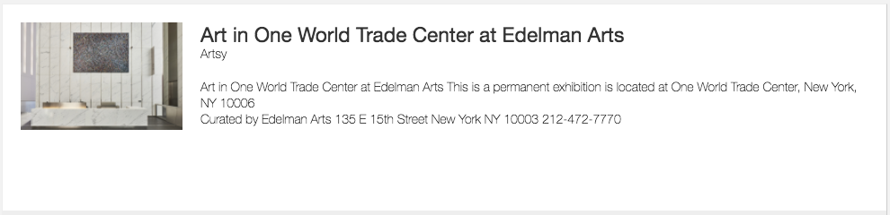

# Elderfield

An Amazon Alexa [skill](functions/artsy) for [Artsy](https://www.artsy.net). Install it on your own Echo [from the Alexa app](http://alexa.amazon.com/spa/index.html#skills/dp/B01MYLJO1N).

This project is named after curator [John Elderfield](https://en.wikipedia.org/wiki/John_Elderfield).

### Implementation Details

See [our blog post on artsy.github.io](http://artsy.github.io/blog/2016/11/30/bringing-artsy-to-amazon-echo-alexa/).

### Demo

Play [this video](https://youtu.be/zi3OubNiV9U).

### Current Skills

#### Ask Artsy about Andy Warhol

* Alexa, ask Artsy about Andy Warhol
* Alexa, ask Artsy about Norman Rockwell
* Alexa, ask Artsy about Pablo Picasso.

This skill adds a card with a more complete bio.

#### Ask Artsy for a Show in Manhattan

* Alexa, ask Artsy to recommend a show in Brooklyn.
* Alexa, ask Artsy for a show around Manhattan.
* Alexa, ask Artsy for a current show in Brooklyn.

This skill adds a card with more information.

#### Ask Artsy to play the latest podcast

* Alexa, ask Artsy to play podcast number 13.
* Alexa, ask Artsy to play the latest podcast.
* Alexa, ask Artsy for a summary of podcast 13.
* Alexa, ask Artsy for a summary of the latest podcast.

Plays and summarizes one of [Artsy podcasts](https://soundcloud.com/artsypodcast).

### Deploying to AWS Lambda

See [DEPLOYMENT](DEPLOYMENT.md).

### Contributing

See [CONTRIBUTING](CONTRIBUTING.md).

### Releasing

See [RELEASING](RELEASING.md).

### License

Copyright (c) 2016-2017 Artsy

MIT License, see [LICENSE](LICENSE.md) for details.
